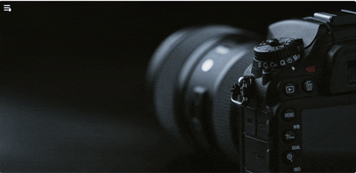

# 📸 Photography Sidebar Menu Project

This project is a **responsive and stylish sidebar navigation menu** for a photography-themed website. It uses **HTML and CSS** with Font Awesome icons to create an interactive user interface inspired by modern UI design trends.

---

## 🚀 Features

- Slide-in/slide-out sidebar with toggle button
- Stylish glassmorphism effect using CSS
- Fully responsive design
- Font Awesome icons for each menu item
- Social media footer with hover animations
- Custom background image integration
- Smooth transitions and hover effects
---

## 📁 Project Structure

```plaintext
📦 Your-Repository
├── projectfile.html        # Main HTML file
├── projectfile.css         # CSS styling
├── cameraimahge.png        # Background image
└── README.md               # This file

## 🛠️ `Technologies Used`
HTML5
CSS3
Font Awesome Icons
Google Fonts (Poppins, Roboto)

---

## 🎬 Project Demo



---


